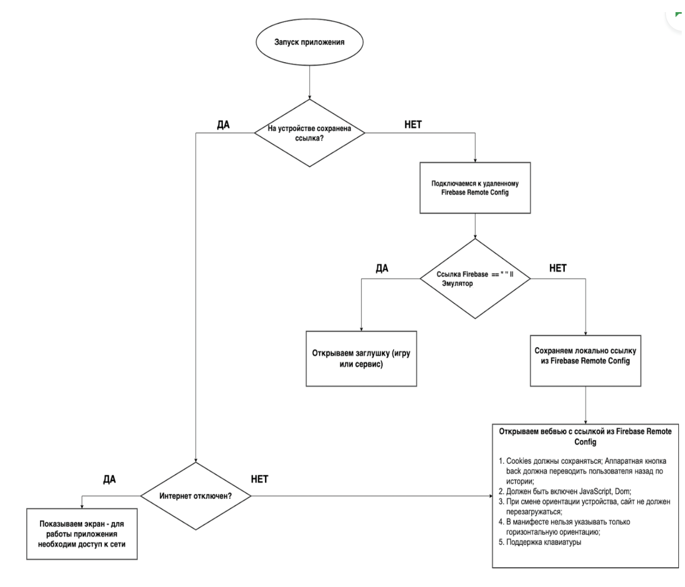

# Task 3 with Tetris game

## App flow

1. The main entry point of the application is the main function. It initializes the Flutter app by calling WidgetsFlutterBinding.ensureInitialized() and then initializes Firebase by calling Firebase.initializeApp(). Finally, it runs the MyApp widget.

2. The MyApp widget is a stateless widget and serves as the root of the application. It creates a MaterialApp widget with a HomePage widget as its home.

3. The HomePage widget is a stateful widget that creates the UI for the home page of the app. It has an associated state class _HomePageState which extends State<HomePage>.

4. In the _HomePageState class, there are several properties defined:

_navigationCompleter: It is a Completer object that will be used to complete a future navigation operation.
_connectivity: It is an instance of Connectivity class used to check the device's connectivity status.
_url: It is a string variable that holds the URL to be loaded in the web view.

5. The initState method is overridden to perform initialization tasks when the HomePage widget is created. It calls the _fetchUrl method to fetch the URL.

6. The _fetchUrl method is responsible for fetching the URL from either Firebase Remote Config or local storage. It first retrieves the locally stored URL from SharedPreferences. Then, it checks the device's connectivity status using Connectivity and handles the case when there is no network connection by showing a network error dialog and setting the _url variable to the locally stored URL.

7. If there is an internet connection, the method proceeds to fetch the URL from Firebase Remote Config using FirebaseRemoteConfig. It sets the configuration settings and then fetches and activates the remote config. It retrieves the URL value from the remote config and checks if it is a valid URL. If the URL is valid or the device is an emulator, it sets the _url variable with the fetched URL.

8. If the URL is empty, it displays a loading indicator. Otherwise, it renders the WebViewPage widget passing the _url value.

9. The dispose method is overridden to perform cleanup tasks when the HomePage widget is removed. It waits for the _navigationCompleter future to complete and then navigates to the TetrisGamePage.

10. The _showNetworkErrorDialog method displays a network error dialog when there is no network connection. It shows an alert dialog with a title and content, and the dialog cannot be closed by the user.

11. The checkIsEmu method is responsible for checking if the device is an emulator. It uses the DeviceInfoPlugin to retrieve information about the Android device and checks various properties to determine if it is an emulator.

12. The build method of the _HomePageState class is called whenever the state changes. If the _url is empty, it displays a CircularProgressIndicator in the center of the screen. Otherwise, it renders the WebViewPage passing the _url value.

## Flow

