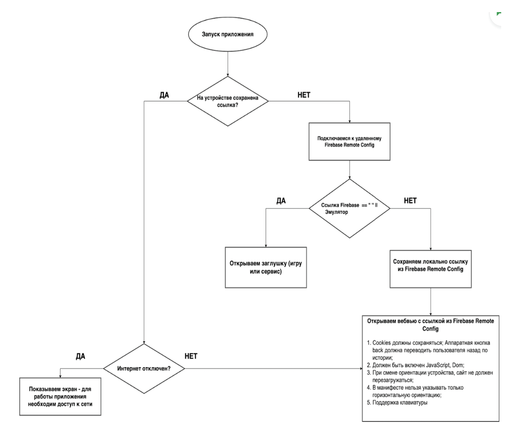

# Task 3 with Tetris game

## App flow

1. When the application is launched, the main() function is the first function that's executed. It ensures Firebase is initialized, and then it starts your MyApp.

2. MyApp is a StatelessWidget that returns a MaterialApp as its widget tree. The root of this MaterialApp is the HomePage.

3. HomePage is a StatefulWidget, which means it can hold mutable state. The corresponding State object is _HomePageState.

4. As soon as HomePage is inserted into the tree, initState() in _HomePageState is called. This method is only called once in the lifecycle of a State object.

5. initState() calls the _fetchUrl() method, which is asynchronous and can be split into a few main parts:

- It fetches the URL from SharedPreferences. This is the URL that was saved from the previous app launch. If there is no URL saved, it sets _url to an empty string.
It checks the device's connectivity. If there's no network connection, it shows a dialog informing the user of the network error and sets _url to the locally saved URL or to an empty string if there is no locally saved URL.
- If there is a network connection, it tries to fetch the URL from Firebase Remote Config.
- It sets the config settings for Firebase Remote Config to fetch the values within a 60 seconds timeout and it sets the minimum fetch interval to 0 seconds.
- It fetches and activates the Firebase Remote Config values.
- It gets the URL from Firebase Remote Config.
- It checks if the device is an emulator. If the URL fetched from Firebase is not empty or the device is not an emulator, it checks if the locally saved URL is different from the fetched URL. If it is different, it saves the fetched URL in SharedPreferences and sets _url to the fetched URL. If the URL fetched from Firebase is empty and the device is an emulator, it navigates to the Tetris game page.
- If there's an error while fetching the URL from 

6. Firebase Remote Config, it shows a dialog informing the user of the network error.
build() in _HomePageState is called whenever _url is updated. If _url is empty, it shows a loading spinner. Otherwise, it shows the WebViewPage with the URL.

7. When _HomePageState is removed from the tree (for example, when navigating away from the HomePage), dispose() is called. If the navigation to the Tetris game page has not been completed yet, it completes the navigation in the dispose() method.

## Screenshots

